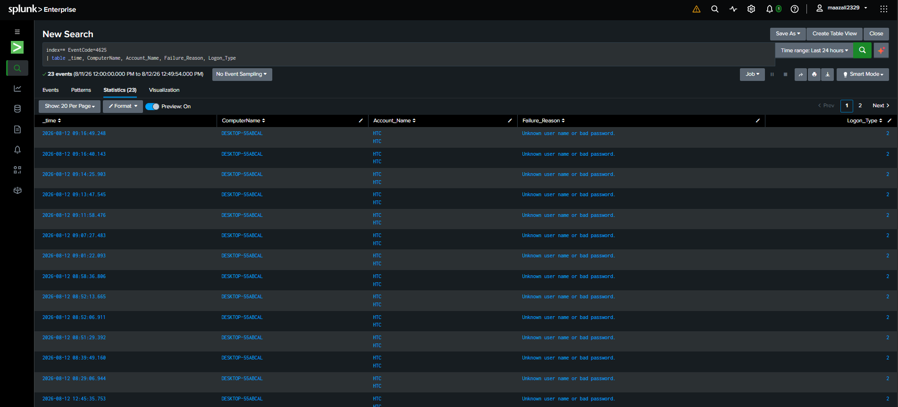
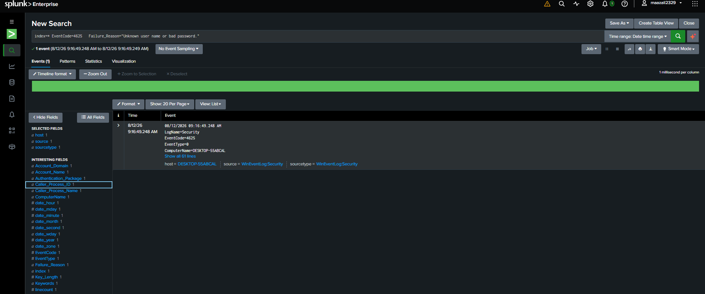

# Incident Report #01 — Repeated Failed Logon Attempts (Event ID 4625)

## Summary
Investigated 23 failed logon events on host DESKTOP-55ABCAL within a
24-hour window using Splunk Enterprise ingesting Windows Security logs.

## Detection
- **Data source:** Windows Security Event Log (sourcetype: WinEventLog:Security)
- **Query used:**
  `sourcetype="WinEventLog:Security" EventCode=4625 | table _time, ComputerName, Account_Name, Failure_Reason, Logon_Type`
- **Events found:** 23 failed logon attempts over 24 hours

## Analysis
All 23 events shared identical characteristics:
- Account: HTC
- Computer: DESKTOP-55ABCAL (single host, no other machines involved)
- Failure Reason: Unknown user name or bad password
- Logon Type: 2 (Interactive — local console logon, not remote/network)

The consistent Logon Type 2 indicates these attempts originated from
physical/local access to the machine rather than a remote source,
which significantly lowers the likelihood of an external brute-force
attack. The repeated failures against a single known account, with no
variation in target account or source, is consistent with local user
password-entry errors rather than malicious credential-stuffing
activity (which typically targets multiple accounts or originates
from remote/network logon types).

## MITRE ATT&CK Mapping
T1110.001 — Brute Force: Password Guessing (evaluated but assessed as
low-confidence / likely benign given Logon Type 2 and single-account
pattern)

## Assessment
Low risk. Pattern is consistent with legitimate local user error
rather than an attack. No evidence of remote logon attempts (Type 3/10)
or multiple targeted accounts, which would indicate credential-stuffing
or brute-force activity.

## Recommendation
- No immediate action required for this instance
- Recommend baseline alerting threshold (e.g. 5+ failures in 10 min)
  for future monitoring, particularly for Logon Type 3/10 (remote)
  which would carry higher risk
- Periodically review Security event logs for repeated failures
  from unfamiliar accounts or remote sources

## Screenshots

